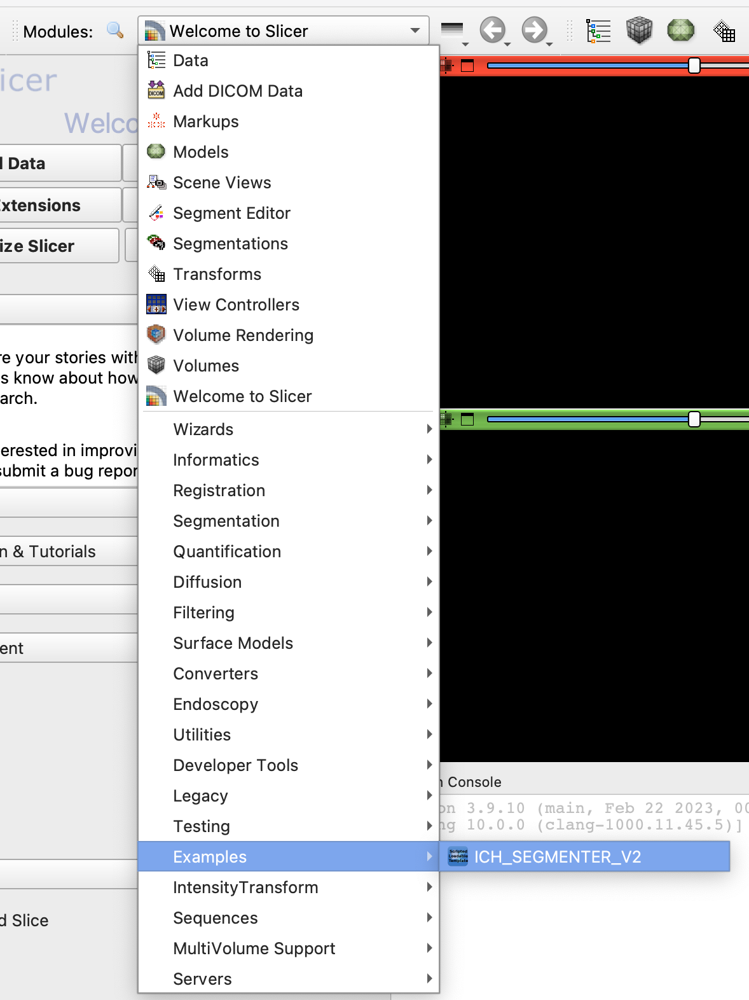
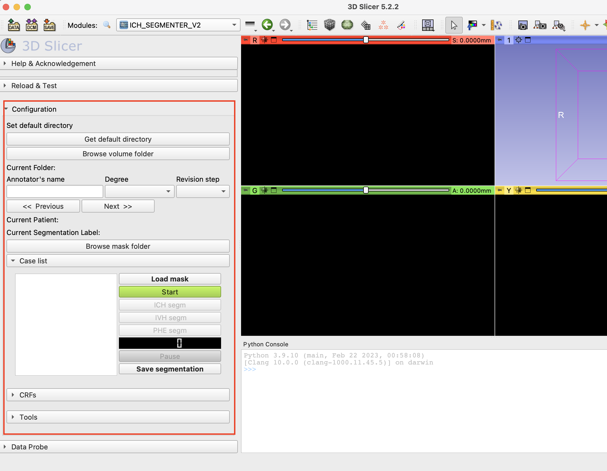
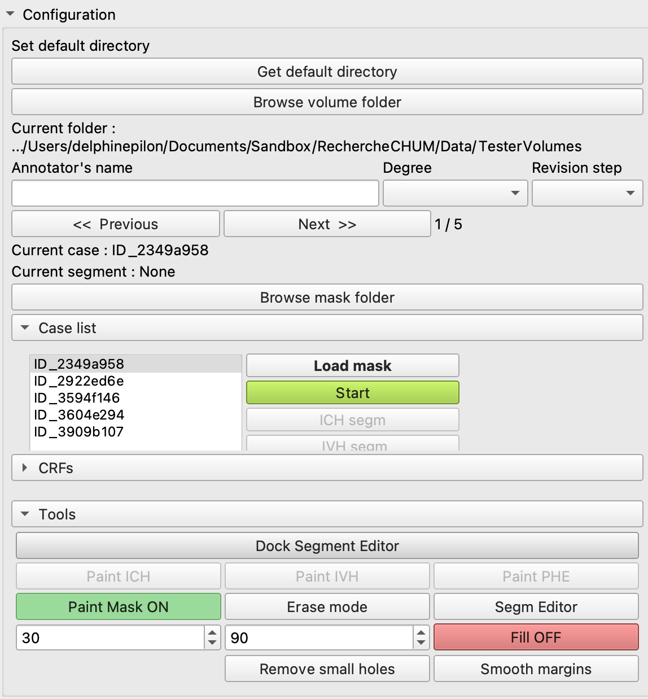
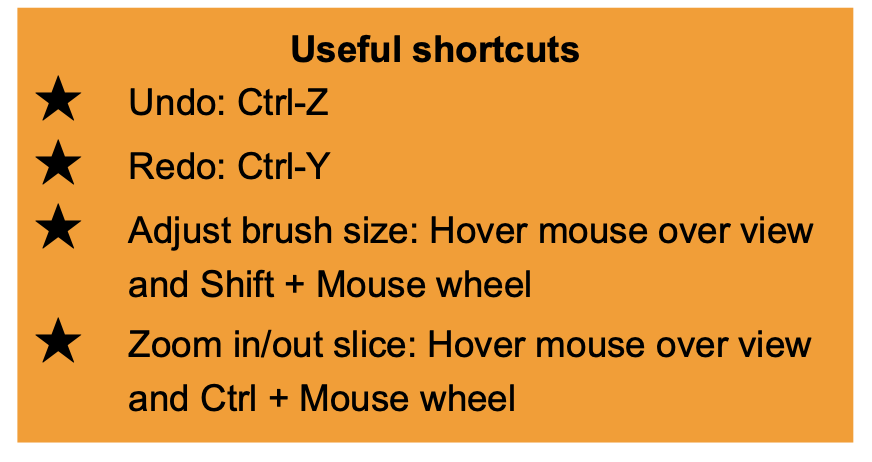

# How to use this extension?

## Video Tutorial

Here is a [tutorial](https://drive.google.com/drive/folders/1GQJi9Qqy5FyzHR690quK81nSt4WMXBbd) on how to use this extension as of May 2023. The tutorial is only available in French. 

## Step by step instructions

1. Open 3D Slicer.
2. Go to the module ICH_SEGMENTER_V2.

3. The extension should look like : 

4. With the buttons "Get default directory" and "Browse volume folder", choose the folder containing your `.nrrd` files. You should see your files appear in the window as follows. 

5. Fill the fields "Annotator's name", "Degree", and "Revision step". 
6. To start annotating the volumes, you must press on "Start". The buttons to add segments and to paint segments will become available afterwards. At any moment, you may press "Pause"/"Restart" and the timers will be stopped. 
7. The 3 segmentation modes are ICH (intracerebral hemorrhage), IVH (intraventricular hemorrhage), and PHE (perihematomal edema). There are additional tools in the section "Tools" such as an eraser, a tool to fill small holes, as well as a tool to smooth borders. In addition, it is possible to hide the fill of the segmentation to better visualize its borders. 

8. When you are satisfied with your annotations, you may press "Save segmentation". 

### Note that:
* There is no "undo" button in this extension. In order to undo an action, you must go to the module "Segment Editor". 
* There are keyboard shortcuts available in the module "Segment Editor" that will reduce annotation times. 
    * [Segment Editor Documentation](https://slicer.readthedocs.io/en/latest/user_guide/modules/segmenteditor.html)
    * 
* For more information: [RSNA ICH/IVH Annotation Guidelines](https://docs.google.com/presentation/d/1rNnL9DYoIV6n5kgpZJnEqtFvqLkHsEsz31M2za32U_s/edit#slide=id.g221166f35e0_0_34)
